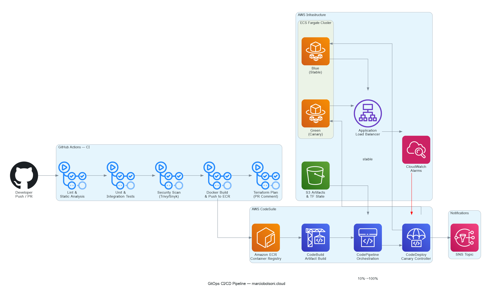
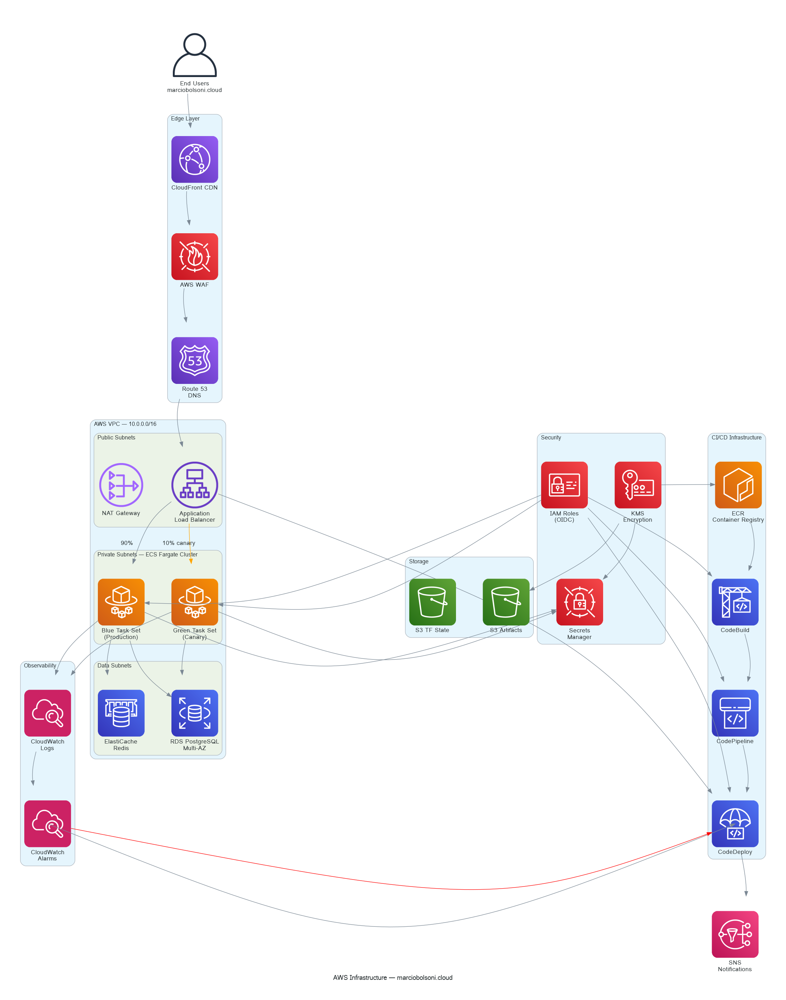
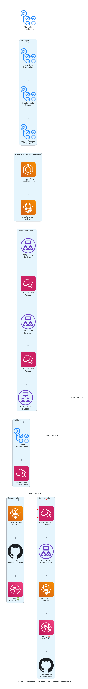

# marciobolsoni.cloud — GitOps CI/CD Suite



This repository contains a production-grade, modular DevOps project for **marciobolsoni.cloud**, featuring a complete GitOps CI/CD suite built on GitHub Actions and AWS. The architecture is designed for high availability, security, and developer velocity, incorporating automated canary deployments and robust rollback mechanisms.

This project serves as a comprehensive portfolio piece demonstrating advanced DevOps principles and practices.

## 🌟 Features

- **GitOps Workflow**: A single source of truth in Git drives all infrastructure and application changes.
- **Automated CI/CD**: End-to-end continuous integration and delivery pipelines powered by GitHub Actions and AWS CodeSuite.
- **Canary Deployments**: Automated, risk-mitigated releases using AWS CodeDeploy to shift traffic progressively (10% → 50% → 100%).
- **Automated Rollbacks**: CloudWatch alarms monitor key metrics (error rate, latency, CPU) and trigger automatic rollbacks on performance degradation.
- **Infrastructure as Code (IaC)**: The entire AWS infrastructure is defined and managed using Terraform, organized into reusable modules.
- **Security by Design**: OIDC-based authentication between GitHub Actions and AWS, security scanning (Trivy, Checkov, Snyk), and least-privilege IAM roles.
- **Comprehensive Observability**: Centralized logging, metrics, and dashboards via Amazon CloudWatch, with automated alerting through SNS.
- **Developer-Centric**: Pull request-based workflows with automated checks, tests, and Terraform plan previews.

## 🏛️ Architecture Overview

The architecture is composed of three primary pillars: the CI/CD pipeline, the AWS infrastructure, and the deployment strategy.

### 1. CI/CD Pipeline

The pipeline is orchestrated by GitHub Actions, which handles continuous integration, and AWS CodePipeline/CodeDeploy for continuous delivery.


*Full CI/CD workflow from developer commit to production deployment.*

### 2. AWS Infrastructure

The infrastructure is deployed across a multi-AZ VPC for high availability. It leverages ECS Fargate for serverless container orchestration, an Application Load Balancer for traffic management, and RDS for the database layer.


*High-level view of the AWS infrastructure components and their interactions.*

### 3. Canary Deployment & Rollback Strategy

Deployments are managed by AWS CodeDeploy, which performs a canary release by shifting traffic incrementally. CloudWatch alarms monitor the new version, and if any metric breaches its threshold, an automated rollback is triggered.


*The canary deployment process, including traffic shifting, validation, and the automated rollback path.*

## 📚 Documentation

- **[ARCHITECTURE.md](docs/ARCHITECTURE.md)**: A detailed breakdown of the architecture, components, design decisions, and security considerations.
- **[RUNBOOK.md](docs/RUNBOOK.md)**: Operational guides for common tasks, including manual deployments, rollbacks, and incident response.
- **[TERRAFORM.md](docs/TERRAFORM.md)**: Information on the Terraform module structure and environment setup.

## 🚀 Getting Started

### Prerequisites

1.  **AWS Account**: With appropriate permissions to create the resources defined in the Terraform modules.
2.  **GitHub Repository**: A GitHub repository with GitHub Actions enabled.
3.  **Secrets**: The following secrets must be configured in the GitHub repository settings (`Settings > Secrets and variables > Actions`):
    - `AWS_ROLE_ARN`: The ARN of the IAM role for GitHub Actions to assume.
    - `TF_STATE_BUCKET`: The name of the S3 bucket for Terraform remote state.
    - `TF_LOCK_TABLE`: The name of the DynamoDB table for Terraform state locking.
    - `SLACK_WEBHOOK_URL`: The incoming webhook URL for Slack notifications.
    - `SNYK_TOKEN`: Your Snyk API token for vulnerability scanning.

### Deployment

1.  **Push to `staging`**: Pushing code to the `staging` branch will automatically trigger the `cd-staging.yml` workflow, which deploys the application to the staging environment.
2.  **Open a Pull Request**: Create a pull request from your feature branch to `main`. The `ci.yml` workflow will run, performing linting, testing, security scans, and generating a Terraform plan comment.
3.  **Merge to `main`**: Once the PR is approved and merged, the `cd-production.yml` workflow is triggered.
4.  **Manual Approval**: The production workflow includes a manual approval gate. A required reviewer must approve the deployment in the GitHub Actions UI.
5.  **Canary Rollout**: After approval, CodeDeploy begins the automated canary rollout to the production environment.

## 📁 Repository Structure

```
marciobolsoni-cloud/
├── .github/                    # GitHub Actions workflows, PR templates, CODEOWNERS
│   ├── workflows/
│   │   ├── ci.yml              # Continuous Integration (lint, test, scan, build)
│   │   ├── cd-staging.yml      # Continuous Deployment to Staging
│   │   ├── cd-production.yml   # Continuous Deployment to Production
│   │   ├── rollback.yml        # Manual Rollback workflow
│   │   └── security.yml        # Scheduled security scans
│   ├── pull_request_template.md
│   └── CODEOWNERS
├── diagrams/                   # Source files for architecture diagrams (Mermaid)
├── docs/
│   ├── images/                 # PNG versions of architecture diagrams
│   ├── ARCHITECTURE.md         # In-depth architecture documentation
│   └── RUNBOOK.md              # Operational procedures and runbooks
├── infrastructure/
│   ├── appspec/                # AWS CodeDeploy AppSpec files
│   └── terraform/
│       ├── modules/            # Reusable Terraform modules (VPC, ECS, ALB, etc.)
│       └── environments/       # Environment-specific configurations (dev, staging, prod)
├── scripts/                    # Helper scripts for deployment hooks, tests, and rollbacks
├── src/                        # Placeholder for application source code
├── .gitignore
├── buildspec.yml               # AWS CodeBuild specification (alternative to GitHub Actions build)
└── README.md                   # This file
```
